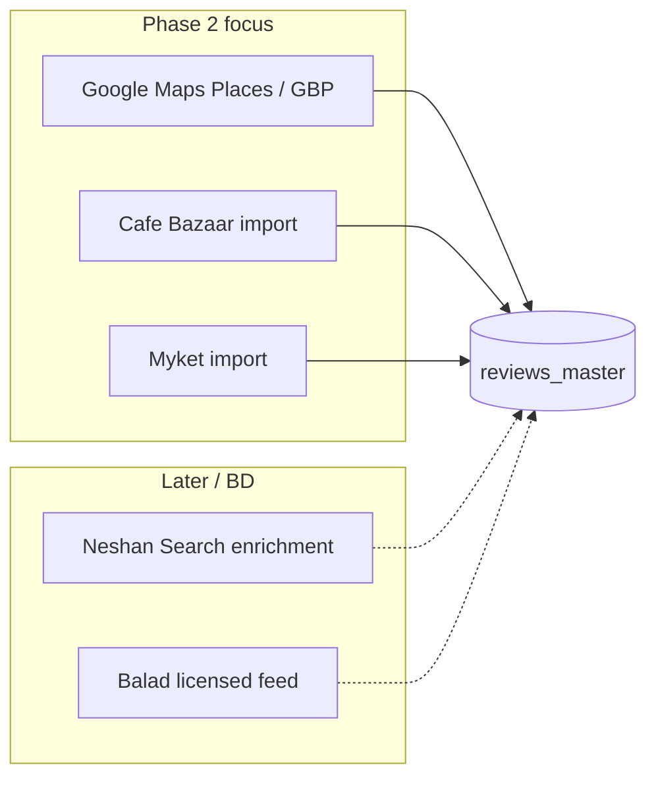

# Source Feasibility Report — BrandMonitor Phase 2 Data Sources

**Status:** Research only — no collectors or production code were implemented for this study.  
**Date:** 2026-08-03  
**Scope:** Google Maps, Neshan, Balad, Cafe Bazaar, Myket  

---

## Executive summary

| Rank | Source | Fit for Phase 2 | Verdict |
|------|--------|-----------------|---------|
| 1 | **Google Maps** | Primary | Only source with an official, documented review-related API path (Places API New; GBP for owned locations). Hard review cap (5/place via Places) and strict ToS/caching rules. Prefer API + attribution over browser scraping. |
| 2 | **Cafe Bazaar** | Secondary (controlled) | No official third-party review API. High-value app-store sentiment for logistics apps if obtained via **developer partnership, export, or licensed import** — not fragile REST spoofing. |
| 3 | **Myket** | Secondary (controlled) | Same pattern as Cafe Bazaar: official APIs are IAP/intent/publish; reviews are store/panel-facing. Use import adapters only. |
| 4 | **Neshan** | Deferred | Strong official map/search/routing APIs; **no public user-review API**. Scraping consumer app/site is unstable and ToS-risky. |
| 5 | **Balad** | Deferred / avoid auto-scrape | Embed-only official surface; community scrapers hit undocumented `raah.ir` endpoints. Unsuitable as a production collector baseline. |

**Phase 2 recommendation:** Double down on **compliant Google Maps Places (and GBP where ownership exists)**, keep Iranian map/app-store sources behind the existing **provider + import/API adapter** architecture, and do **not** ship fragile scrapers for Neshan, Balad, Cafe Bazaar, or Myket.

---

## Scoring methodology

Each dimension is scored **1 (poor) → 10 (excellent)** for BrandMonitor’s use case (branch-level logistics reputation: review text, ratings, dates, replies, branch identity).

| Dimension | Meaning |
|-----------|---------|
| Data Availability | Can we obtain enough reviews and related fields for target brands? |
| Data Quality | Completeness, structure, language usefulness for NLP |
| Reliability | Stability of access path over months |
| Maintainability | Effort to keep working when APIs/UI change |
| Scalability | Cost and feasibility to cover many brands/branches nationwide |

**Composite** = average of the five scores (equal weight).

---

## Cross-source capability matrix

| Capability | Google Maps | Neshan | Balad | Cafe Bazaar | Myket |
|------------|:-----------:|:------:|:-----:|:-----------:|:-----:|
| Official public API for reviews | Partial¹ | No | No | No | No |
| Official API for places/search | Yes | Yes | No (embed only) | N/A (apps) | N/A (apps) |
| Review text | Yes¹ | Consumer only | Consumer / undocumented | Store / undocumented | Store / panel |
| Ratings | Yes | Consumer only | Likely in POI payloads (unofficial) | Yes (store UI) | Yes (store UI) |
| Branch / POI info | Yes | Yes (search) | Yes (unofficial) | App-level, not branch | App-level, not branch |
| Review dates | Yes (API) | Unknown officially | Unclear | Likely in unofficial payloads | Likely in UI |
| Reviewer names | Yes (attribution) | Unknown | Unclear | Pseudonyms typical | Pseudonyms typical |
| Business replies | Places: limited; GBP: yes for owned | Unknown | Unknown | Sometimes in store threads | Sometimes |
| Anti-bot on web | Strong (Maps UI) | Yes (platform/site) | Present on consumer | Moderate / API spoofing | Moderate |
| Auth required for reviews | API key (Places); OAuth (GBP) | API key for map APIs (not reviews) | None for public pages; none documented for reviews | Dev OAuth = IAP only | Dev auth = IAP/panel |
| Recommended path | Official API | Import / BD | Import only | Import / partnership | Import / partnership |

¹ Places API (New): **max 5 reviews per place**, sorted by relevance; full history for **owned** locations via Google Business Profile API.

---

## 1. Google Maps

### Investigation answers

| # | Question | Finding |
|---|----------|---------|
| 1 | Official public API? | **Yes (partial for reviews).** Places API (New) exposes place details including `reviews[]`, `rating`, `userRatingCount`, address, phone, geometry, `place_id`. Google Business Profile (GBP) API lists reviews for **managed** locations with pagination. |
| 2 | Options if insufficient? | (a) Places API Place Details for discovery + sample reviews; (b) GBP for owned brands; (c) licensed data partners; (d) browser automation — **technically possible but ToS-prohibited / fragile** (current historical crawlers in-repo are high legal/ops risk). |
| 3 | Automated collection stable? | **API path: high.** Browser scrape path: **low** (DOM/XHR churn, CAPTCHA, account risk). |
| 4 | Anti-bot? | **Yes** on consumer Maps web/app surfaces. Official Places/GBP HTTP APIs are key/OAuth gated, not CAPTCHA-gated in the same way. |
| 5 | Authentication? | Places: **API key** (+ billing). GBP: **OAuth** as business owner/manager. |
| 6 | Review text? | **Yes** via Places (`text` / `originalText`) and GBP. |
| 7 | Ratings? | **Yes** — per-review `rating` and place-level `rating` / `userRatingCount`. |
| 8 | Branch information? | **Yes** — name, address, phone, hours, coords, `place_id` (store indefinitely). |
| 9 | Review dates? | **Yes** — `publishTime`; relative descriptions; `visitDate` in some locales. |
| 10 | Reviewer names? | **Yes** — `authorAttribution` (display name + photo URI + profile URI); attribution **required** when displaying. |
| 11 | Business replies? | Places sample reviews: **limited / not a full reply feed**. GBP: **yes** for owned locations (reply APIs). |
| 12 | Estimated review volume | **High for logistics brands** on Maps (hundreds–thousands per large brand across branches). Official Places returns **≤5 reviews/place**; aggregate `userRatingCount` still available. Full text corpus requires GBP ownership or non-API channels. |
| 13 | Update frequency | New reviews continuously; practical poll cadence **daily–weekly** per place (cost-bounded). |
| 14 | Maintenance cost | **Low–medium** for Places/GBP adapters; **high** if scraping. Billing scales with Place Details calls. |
| 15 | Technical risks | 5-review cap; SKU/pricing; field mask mistakes; attribution bugs; mixing Maps content with non-Google maps (forbidden); coord cache ≤30 days. |
| 16 | Legal / ToS | Must not scrape/warehouse Maps content outside allowed exceptions. Prefer Places/GBP. Store `place_id` freely; temporary lat/lng cache ≤30 days; provide attributions and review-ordering notice; Privacy Policy / ToS linkage required. |
| 17 | Recommended approach | **Places API (New)** for branch discovery + rating counts + up to 5 reviews; **GBP** where BrandMonitor or partners manage listings; keep scrape crawlers **out of Phase 2 production**; normalize into existing `google_maps` provider. |

### Scores

| Dimension | Score | Notes |
|-----------|------:|-------|
| Data Availability | 7 | Rich branch graph; review **text** capped at 5/place via Places |
| Data Quality | 9 | Structured fields, dates, authors, multilingual text |
| Reliability | 9 | Mature Google Cloud APIs |
| Maintainability | 8 | Versioned SDKs; billing/quotas to manage |
| Scalability | 7 | Cost per Place Details; nationwide fan-out needs budgeting |
| **Composite** | **8.0** | |

### Estimated development effort

| Work package | Effort | Scope |
|--------------|--------|-------|
| Places Place Details + Search adapter (compliant) | **M** | Field masks, attribution storage, rate limits, place_id registry |
| GBP reviews for owned locations | **M–L** | OAuth multi-tenant, pagination, reply sync |
| Retire / quarantine scrape crawler from prod path | **S** | Config flags + docs; no new scrape features |
| Unified schema mapping (already partly done) | **S** | Align with `reviews_master` |

---

## 2. Neshan (نشان)

### Investigation answers

| # | Question | Finding |
|---|----------|---------|
| 1 | Official public API? | **Yes for maps; No for reviews.** Neshan Maps Platform (`platform.neshan.org` / `api.neshan.org`): Search, Geocoding, Reverse Geocoding, Direction, Distance Matrix, Map Matching, Map SDKs. **No documented Reviews/Comments API.** |
| 2 | Options for collecting data? | (a) Official Search for **branch discovery/enrichment** only; (b) commercial data partnership / BD with Rajman; (c) manual/CSV export if ever offered; (d) reverse-engineer consumer app APIs — **unstable, ToS-risky**; (e) HTML scrape of consumer site — anti-bot + brittle. |
| 3 | Automated review collection stable? | **No** without an official review feed. Map APIs themselves are stable for geo use. |
| 4 | Anti-bot? | **Yes** on developer/platform and consumer surfaces (bot checks observed on platform portal). |
| 5 | Authentication? | Map APIs: **API key** per service. Reviews: N/A officially. |
| 6 | Review text? | **Not via official API.** Present in consumer product UX only. |
| 7 | Ratings? | **Not via official API** (may appear in app POI UI). |
| 8 | Branch information? | **Yes** via Search / geocoding (name, location; detail depth depends on product). Useful for Iran-local POI enrichment. |
| 9 | Review dates? | **Not officially.** |
| 10 | Reviewer names? | **Not officially.** |
| 11 | Business replies? | **Not officially.** |
| 12 | Estimated review volume | Consumer app has substantial UGC nationally, but **volume accessible to BrandMonitor without scrape ≈ 0**. |
| 13 | Update frequency | Map POI data updates frequently; review access N/A. |
| 14 | Maintenance cost | Low for Search enrichment; **very high** if scraping reviews. |
| 15 | Technical risks | Assuming Search responses include reviews (they don’t); key quotas; Persian query tuning; confusing platform vs consumer APIs. |
| 16 | Legal / ToS | Use only licensed Platform APIs per Neshan developer terms. Scraping consumer Neshan for reviews likely violates ToS and may breach computer-access norms. Prefer written commercial agreement for UGC. |
| 17 | Recommended approach | **Do not build a review scraper.** Optional: Neshan Search as **geo enrichment** for Iranian branches. Reviews: **import adapter + partnership track** only. |

### Scores

| Dimension | Score | Notes |
|-----------|------:|-------|
| Data Availability | 2 | Reviews not API-accessible |
| Data Quality | 3 | Hypothetical UGC quality unknown; official path empty |
| Reliability | 3 | No supported review pipeline |
| Maintainability | 2 | Any scrape would break often |
| Scalability | 2 | Cannot scale reviews legally/stably |
| **Composite** | **2.4** | |

### Estimated development effort

| Work package | Effort | Scope |
|--------------|--------|-------|
| Review collector (scrape) | **Do not implement** | — |
| Search enrichment adapter (optional) | **S–M** | API keys, query templates for Tipax/Chapar/etc. |
| Import JSON/CSV provider (already patterned) | **S** | Manual/partner dumps |
| Partnership / legal outreach | **External** | Non-engineering |

---

## 3. Balad (بلد)

### Investigation answers

| # | Question | Finding |
|---|----------|---------|
| 1 | Official public API? | **No** for places/reviews. Official developer-facing offer is primarily **map embed** (iframe from share → “گنجاندن نقشه”). |
| 2 | Options? | (a) Embed only (display, not analytics); (b) undocumented endpoints used by community scrapers (`search.raah.ir`, `poi.raah.ir`) — **not supported**; (c) partnership with Balad/Snapp ecosystem; (d) manual import. |
| 3 | Automated collection stable? | **No.** Undocumented APIs change without notice; scrapers report “public API” incorrectly. |
| 4 | Anti-bot? | Consumer web/app protections exist; undocumented APIs may add rate limits/blocks over time. |
| 5 | Authentication? | Public pages: generally none. No official review API auth model. |
| 6 | Review text? | **Not officially.** May exist in app; scrapers focus more on POI/phone/rating than full review corpora. |
| 7 | Ratings? | Community scrapers claim rating extraction via POI endpoints — **unofficial**. |
| 8 | Branch information? | Rich POI graph in product; accessible unofficially (name, phone, address, category) — **not a supported integration**. |
| 9 | Review dates? | **Unclear / unsupported.** |
| 10 | Reviewer names? | **Unclear / unsupported.** |
| 11 | Business replies? | **Unsupported.** |
| 12 | Estimated review volume | Product markets 1M+ POIs; review depth for logistics brands **unknown** and **not legally harvestable at scale**. |
| 13 | Update frequency | Live POI map; irrelevant without legal access. |
| 14 | Maintenance cost | **Very high** for reverse-engineered collectors. |
| 15 | Technical risks | Endpoint breakage; IP bans; incomplete review schema; false confidence from GitHub scrapers. |
| 16 | Legal / ToS | Scraping undocumented Balad/Raah APIs is ToS-hostile and fragile. Prefer commercial data license or skip. |
| 17 | Recommended approach | **Defer.** Keep `BaladProvider` as **import-only**. No production scraper. Revisit only with written API/license. |

### Scores

| Dimension | Score | Notes |
|-----------|------:|-------|
| Data Availability | 2 | No supported review access |
| Data Quality | 3 | Unknown structured review quality |
| Reliability | 1 | Undocumented = unreliable |
| Maintainability | 1 | Would require constant reverse engineering |
| Scalability | 2 | Blocks/rate limits likely at scale |
| **Composite** | **1.8** | |

### Estimated development effort

| Work package | Effort | Scope |
|--------------|--------|-------|
| Undocumented API collector | **Do not implement** | — |
| Import adapter validation | **S** | Schema fixtures only |
| Future official API client | **M** | Contingent on Balad publishing docs |

---

## 4. Cafe Bazaar (کافه بازار)

### Investigation answers

| # | Question | Finding |
|---|----------|---------|
| 1 | Official public API? | **Official Developer API exists but is for IAP/subscriptions/purchase validation** (OAuth client on developer panel) — **not** a third-party review firehose. |
| 2 | Options? | (a) Developer panel export if available for **own** apps; (b) commercial agreement / bulk data; (c) undocumented `ReviewRequest` REST (`api.cafebazaar.ir/rest-v1/process/ReviewRequest`) used by community crawlers — requires forged `clientID`/`deviceID` payloads; (d) Selenium on store pages. |
| 3 | Automated collection stable? | Unofficial REST: **medium-low** (works until payload/schema changes). Selenium: **low**. Official IAP API: stable but irrelevant to competitor reviews. |
| 4 | Anti-bot? | Store site moderate; unofficial API may soft-block abusive clients. |
| 5 | Authentication? | Official Dev API: **OAuth**. Public review listing via spoofed client properties historically **without user login**, but not authorized for third-party harvesting. |
| 6 | Review text? | **Yes in store / unofficial payloads.** |
| 7 | Ratings? | **Yes** (1–5 typical). |
| 8 | Branch information? | **No** — app-level only (package name), not physical branches. Useful for **brand app reputation**, not branch network. |
| 9 | Review dates? | Typically present in review objects / UI. |
| 10 | Reviewer names? | Display names / nicknames common. |
| 11 | Business replies? | Often present as developer replies in store threads (`userReplies*` fields appear in crawler filters). |
| 12 | Estimated review volume | **Medium–high per major logistics app** (hundreds–tens of thousands depending on install base). One dataset per `packageName`, not per branch. |
| 13 | Update frequency | Continuous user posts; poll **weekly** sufficient for brand sentiment. |
| 14 | Maintenance cost | **High** if unofficial; **low** if partner CSV/API. |
| 15 | Technical risks | Payload fingerprinting; legal exposure; schema drift; mixing app reviews with branch reviews in analytics without clear `source_entity_type`. |
| 16 | Legal / ToS | Unofficial bulk harvest of reviews likely violates Cafe Bazaar terms. Prefer developer-owned exports, written permission, or licensed feeds. Do not ship spoofed `ReviewRequest` clients as “official.” |
| 17 | Recommended approach | **Import/partnership adapter only** for Phase 2. Model as `entity_type=app` (not branch). Optional later: authenticated first-party export for apps BrandMonitor operates. |

### Scores

| Dimension | Score | Notes |
|-----------|------:|-------|
| Data Availability | 6 | Rich if access obtained; zero via official review API |
| Data Quality | 7 | Text + stars + dates + replies useful for NLP |
| Reliability | 4 | Depends on unofficial or human import |
| Maintainability | 4 | Spoofed clients rot; imports are fine |
| Scalability | 5 | Few package names vs thousands of branches |
| **Composite** | **5.2** | |

### Estimated development effort

| Work package | Effort | Scope |
|--------------|--------|-------|
| Production unofficial ReviewRequest client | **Do not implement** | — |
| Hardened import pipeline (CSV/JSON) | **S–M** | Validation, package→brand map, reply fields |
| Analytics separation (app vs branch) | **S** | Filters / entity type |
| Partnership ingestion automation | **M** | If SFTP/email dumps arrive |

---

## 5. Myket (مایکت)

### Investigation answers

| # | Question | Finding |
|---|----------|---------|
| 1 | Official public API? | **No review API.** Documented APIs: IAP verification, in-app product management, publish services, **Intents** (open app page, `myket://comment?id=PACKAGE`). |
| 2 | Options? | (a) Developer panel for **own** apps; (b) HTML/API scrape of public app pages; (c) partnership/import; (d) Intent only helps **submit** ratings, not collect them. |
| 3 | Automated collection stable? | Scrape: **low–medium**. Official collect path: **none**. |
| 4 | Anti-bot? | Typical store protections; less documented than Maps. |
| 5 | Authentication? | Dev panel / IAP APIs authenticated. Public comments page: generally browsable. |
| 6 | Review text? | **Yes on store UI** for published apps. |
| 7 | Ratings? | **Yes.** |
| 8 | Branch information? | **No** — application-level only. |
| 9 | Review dates? | Usually yes in UI. |
| 10 | Reviewer names? | Nicknames typical. |
| 11 | Business replies? | Developer replies possible in store UX; no public API guarantee. |
| 12 | Estimated review volume | **Lower than Cafe Bazaar** for many titles (smaller store share), still useful as secondary Iran Android signal. |
| 13 | Update frequency | Continuous; **weekly** poll conceptually. |
| 14 | Maintenance cost | High if scraping; low if import. |
| 15 | Technical risks | Smaller corpus; scrape breakage; duplicate sentiment vs Cafe Bazaar for same APK. |
| 16 | Legal / ToS | Respect Myket developer/store terms; no unauthorized bulk harvest. Prefer panel export / permission. |
| 17 | Recommended approach | Same as Cafe Bazaar: **import-only provider**, `entity_type=app`, cross-store dedupe by normalized text + brand + rating + date window. |

### Scores

| Dimension | Score | Notes |
|-----------|------:|-------|
| Data Availability | 4 | Smaller store; no official feed |
| Data Quality | 6 | Similar schema to other stores when present |
| Reliability | 3 | No supported API |
| Maintainability | 3 | Scrape or manual |
| Scalability | 4 | Few apps; easy if import, hard if scrape |
| **Composite** | **4.0** | |

### Estimated development effort

| Work package | Effort | Scope |
|--------------|--------|-------|
| Scraper | **Do not implement** | — |
| Import adapter + fixtures | **S** | Parallel to Cafe Bazaar |
| Cross-store dedupe rules | **S–M** | Shared with Cafe Bazaar |

---

## Priority ranking (highest → lowest)

| Priority | Source | Composite | Rationale |
|----------|--------|----------:|-----------|
| **P1** | Google Maps | 8.0 | Only production-grade official path for place reviews + branch graph; aligns with existing BrandMonitor core. |
| **P2** | Cafe Bazaar | 5.2 | Best Iran **app-store** sentiment supplement; proceed via import/partnership, not scrape. |
| **P3** | Myket | 4.0 | Secondary store signal; same architecture as Cafe Bazaar; lower volume. |
| **P4** | Neshan | 2.4 | Excellent for **geo**, useless for **reviews** without BD; optional enrichment only. |
| **P5** | Balad | 1.8 | No official data API; scrape-dependent; lowest priority until licensed. |

---

## Phase 2 implementation recommendation

### Do in Phase 2

1. **Google Maps — compliant deepening**
   - Prefer **Places API (New)** for branch identity, aggregate ratings, and the allowed review sample.
   - Add **GBP** only for brands/locations under authorized OAuth.
   - Enforce attribution, place_id-centric storage, and lat/lng cache policy.
   - Explicitly **exclude** browser scrape expansion from Phase 2 scope.

2. **Cafe Bazaar + Myket — import adapters only**
   - Accept partner/developer CSV/JSON into existing provider interface.
   - Tag `source` + `entity_type=app`; never invent branch IDs from store reviews.
   - Wire NLP/dedupe already used for multi-source master DB.

3. **Architecture**
   - Keep the Phase 12 pattern: `Provider` interface → normalize → dedupe → `reviews_master`.
   - No new fragile collectors for Iranian maps/stores.

### Do not do in Phase 2

- Neshan/Balad HTML or mobile-API reverse engineering for reviews.
- Cafe Bazaar `ReviewRequest` spoofing clients in production.
- Myket Selenium farms.
- Presenting scraped Iranian UGC as “API-backed.”

### Optional parallel (non-blocking)

- Neshan **Search** for Iranian address/POI enrichment (not review KPIs).
- Business development track for Neshan/Balad licensed UGC.

### Success criteria for Phase 2

| Criterion | Target |
|-----------|--------|
| Google path | 100% of automated Maps review rows attributable to Places and/or GBP |
| Iranian stores | ≥1 real import batch each for Cafe Bazaar and Myket (or documented blocker) |
| Legal posture | Written checklist per source (ToS, attribution, retention) |
| Scrapers | Zero new production scrapers; existing Maps scrapers gated off default prod |

---

## Effort summary (engineering)

| Source | Recommended Phase 2 work | Effort | Risk |
|--------|--------------------------|--------|------|
| Google Maps | Places (+ optional GBP) adapter hardening | **M** | Billing, 5-review cap, ToS compliance |
| Cafe Bazaar | Import schema + brand/package mapping | **S–M** | Data supply dependency |
| Myket | Import schema (shared patterns) | **S** | Low volume / supply |
| Neshan | Optional Search enrichment only | **S** or skip | Scope creep into scraping |
| Balad | Docs + import stub only | **XS** | Temptation to use `raah.ir` |

**Overall Phase 2 data-source engineering:** roughly **one medium Google track + two small import tracks**, with Iranian map review collection **explicitly out of scope** pending partnerships.

---

## Appendix A — Official references (research snapshot)

| Source | Primary references |
|--------|-------------------|
| Google Maps | [Places API Place resource](https://developers.google.com/maps/documentation/places/web-service/reference/rest/v1/places); [Places policies / attribution](https://developers.google.com/maps/documentation/places/web-service/policies); [Maps Platform service terms (caching)](https://cloud.google.com/maps-platform/terms/maps-service-terms); GBP reviews for owned locations |
| Neshan | [Neshan Maps Platform / developer APIs](https://platform.neshan.org); Search/Geocoding/Direction docs; no review endpoint in public catalog |
| Balad | [Embed documentation](https://balad.ir/blog/embed-balad-map/); community scrapers citing `search.raah.ir` / `poi.raah.ir` (unsupported) |
| Cafe Bazaar | Developer API v2 (IAP/OAuth); community use of `ReviewRequest` (unsupported for third parties) |
| Myket | [Developer KB](https://myket.ir/kb/) — IAP APIs, comment **Intent** (`myket://comment`), no review list API |

## Appendix B — Decision rules for future collectors

A source may graduate from **import-only** to **automated collector** only if **all** are true:

1. Documented official endpoint (or signed data license).
2. Auth model that BrandMonitor can hold in secrets (key/OAuth), not forged device IDs.
3. Stable schema with review text + rating at minimum.
4. ToS explicitly allows storage for analytics (or counsel sign-off).
5. On-call maintenance owner assigned.

Until then: **provider interface + import adapter only.**

---

*End of SOURCE_FEASIBILITY_REPORT.md — research artifact; no production collectors added.*
