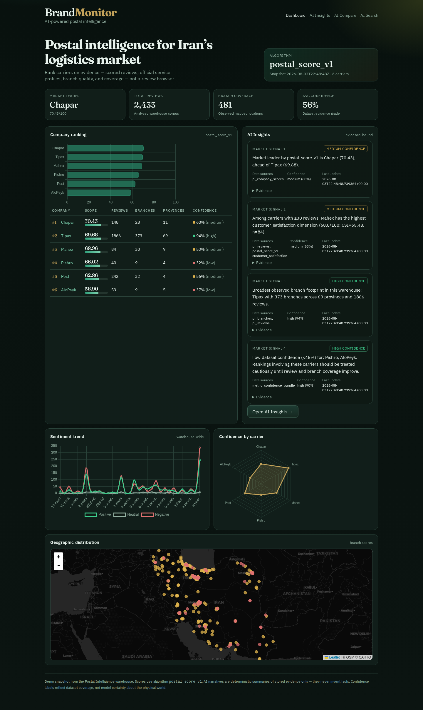
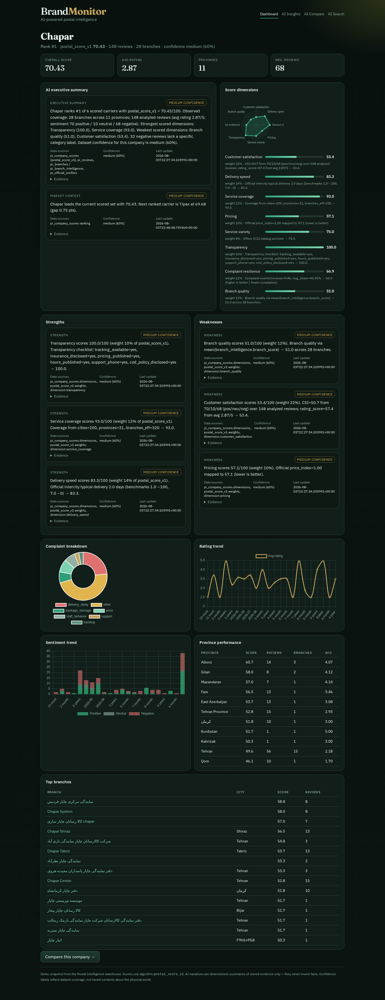
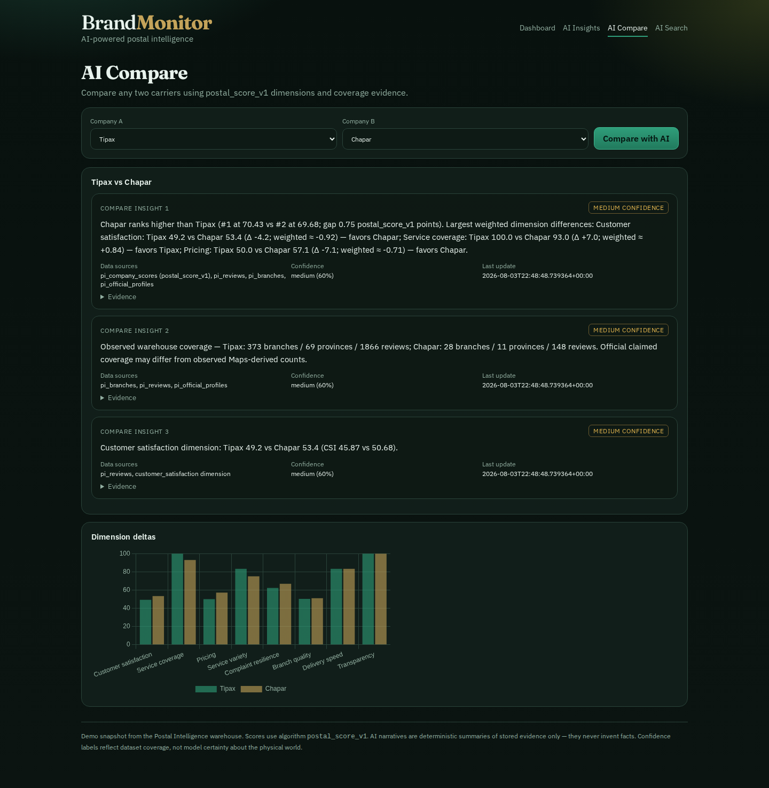
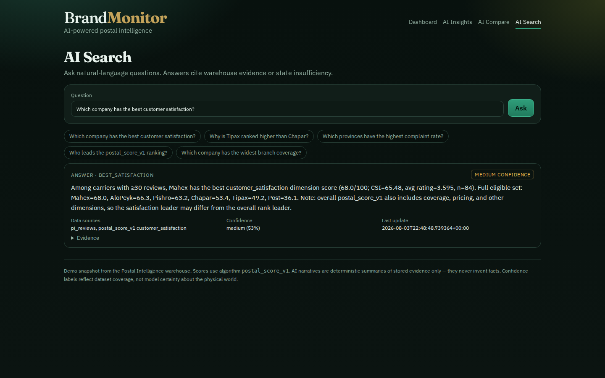
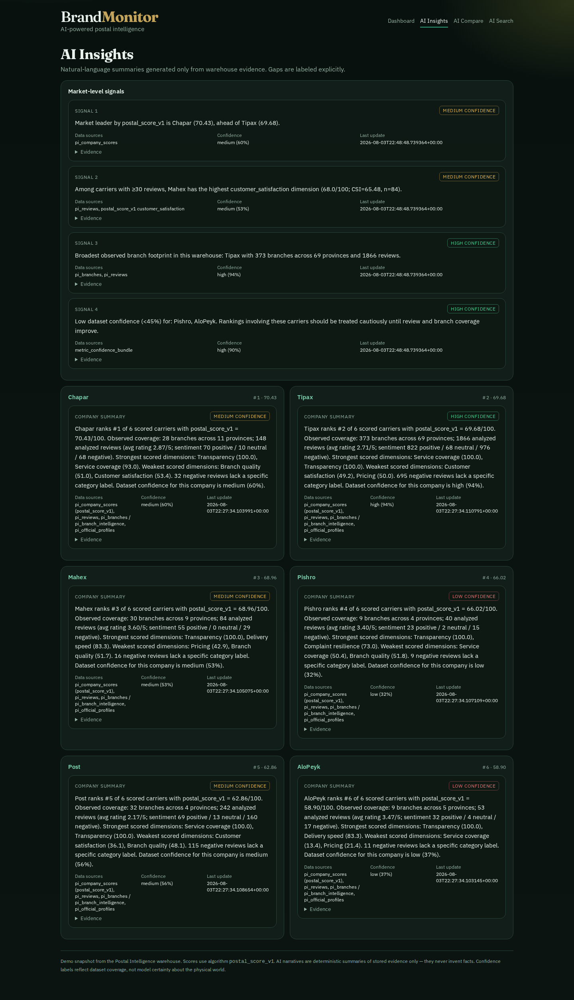
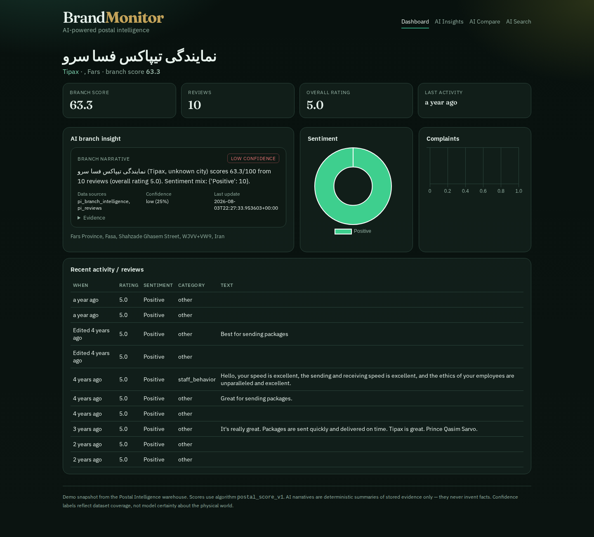

# BrandMonitor Postal Intelligence Demo

Investor-ready interactive demo at **`/intel`**.

## Run

```bash
# ensure warehouse exists
PYTHONPATH=. python3 scripts/build_postal_intelligence.py

# start API
PYTHONPATH=. uvicorn api.main:app --host 127.0.0.1 --port 8000
```

Open:

| Route | Purpose |
|-------|---------|
| `/intel` | Home dashboard — ranking, KPIs, confidence, charts, map |
| `/intel/companies/{slug}` | Company profile + AI executive summary |
| `/intel/branches/{id}` | Branch profile, reviews, sentiment, complaints |
| `/intel/insights` | AI Insights (evidence-bound) |
| `/intel/compare?a=&b=` | AI Compare any two companies |
| `/intel/search?q=` | Natural-language AI Search |

JSON helpers: `/intel/api/snapshot`, `/intel/api/search`, `/intel/api/compare`.

## Screenshots








## AI rules

- Narratives are deterministic summaries of warehouse tables only.
- Every insight shows **data sources**, **confidence**, and **last update**.
- If evidence is thin (e.g. &lt;30 reviews), the UI states insufficiency explicitly.
- Confidence grades dataset coverage; it does **not** alter `postal_score_v1`.
