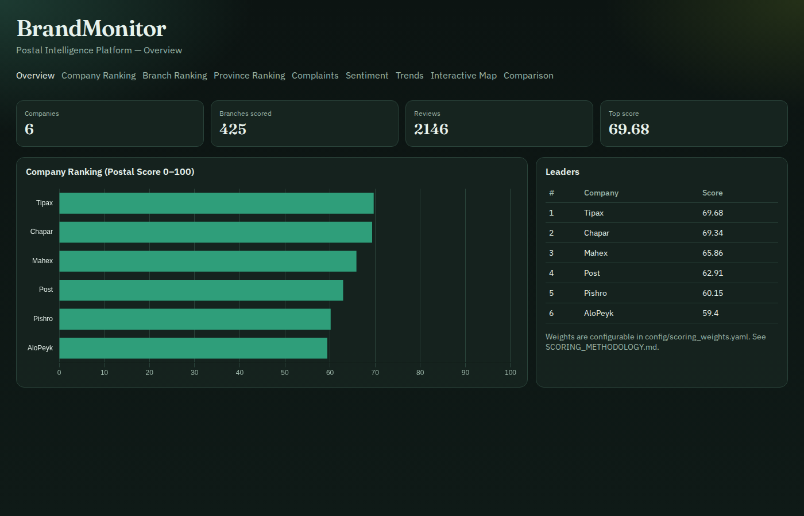
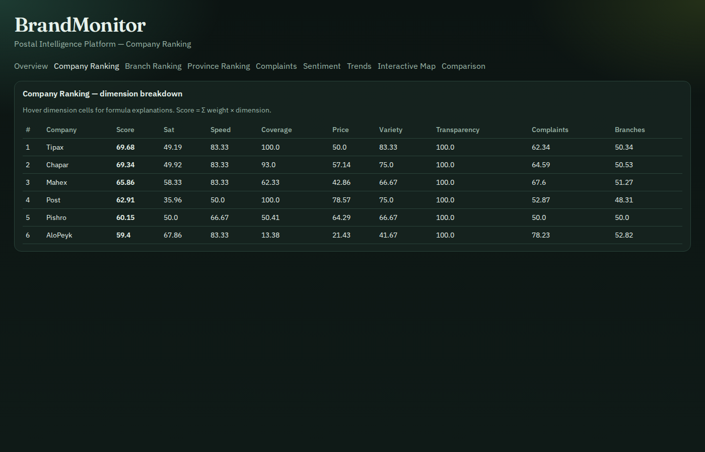
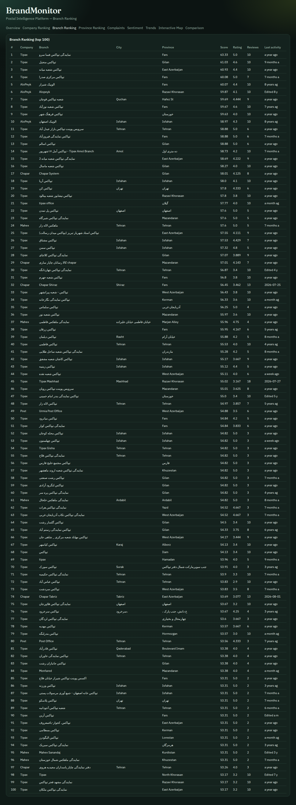
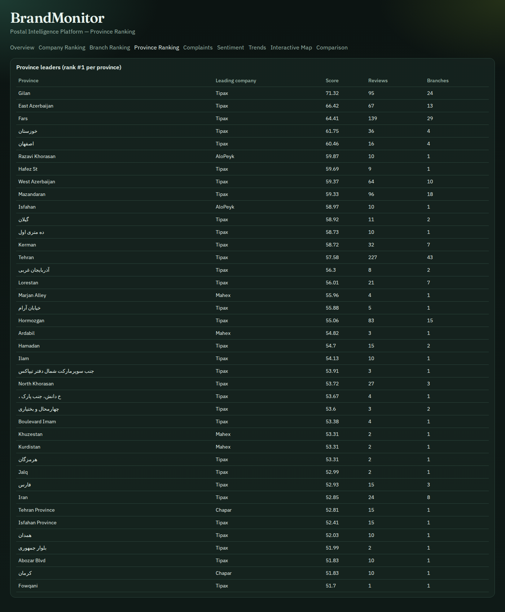
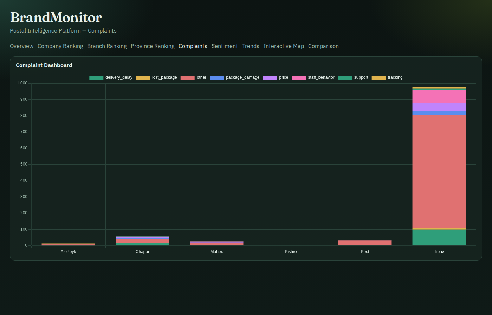
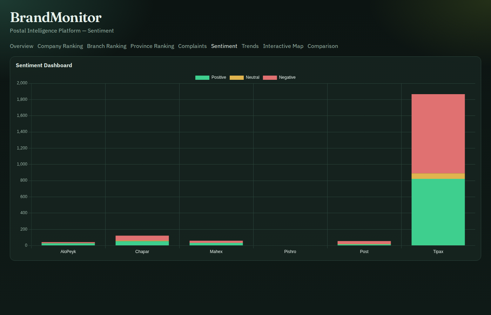
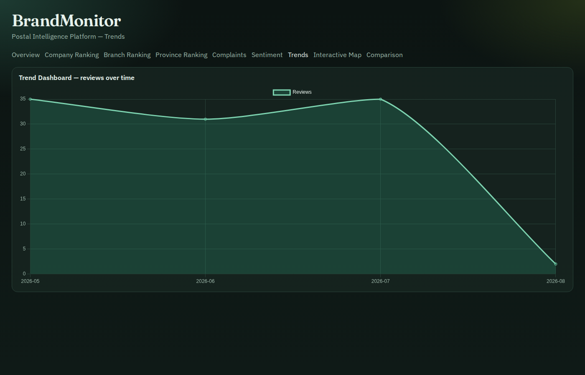
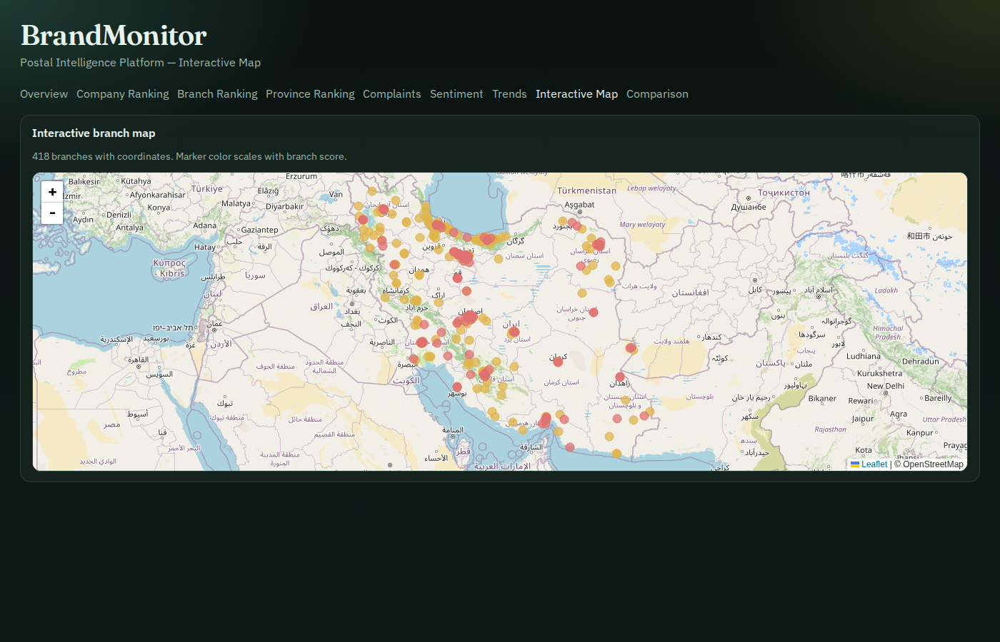
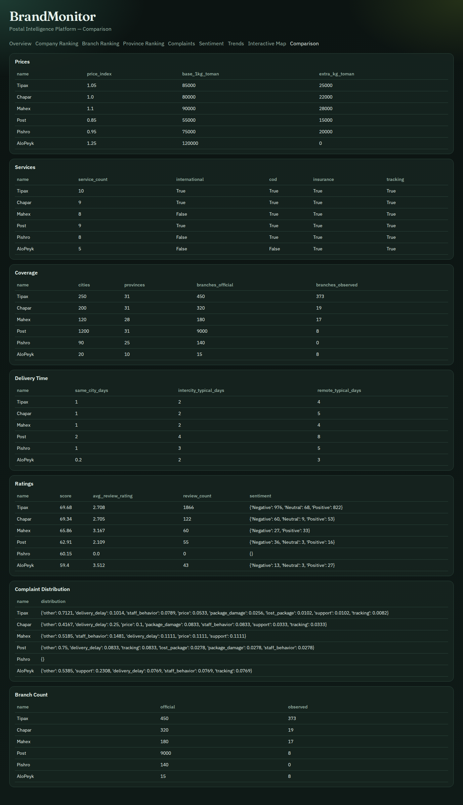

# Postal Intelligence — sample outputs & screenshots

Generated by `python3 scripts/build_postal_intelligence.py`.

## Interactive demo

See **[DEMO.md](DEMO.md)** — investor UI at `/intel` (dashboard, company/branch profiles, AI Insights, AI Compare, AI Search).

## Live sample ranking (postal_score_v1)

| Rank | Company | Score |
|-----:|---------|------:|
| 1 | Tipax | 69.68 |
| 2 | Chapar | 69.34 |
| 3 | Mahex | 65.86 |
| 4 | Post | 62.91 |
| 5 | Pishro | 60.15 |
| 6 | AloPeyk | 59.40 |

Coverage in sample DB: **6 companies**, **425 branches**, **2146 reviews**, **205 geo ranking rows**.

## Screenshots

## Files

- `dashboards/` — HTML dashboards (Chart.js + Leaflet)
- `samples/` — JSON/CSV exports
- `postal_intelligence.sample.db` — SQLite snapshot
- `../SCORING_METHODOLOGY.md` — formulas
- `../POSTAL_INTELLIGENCE.md` — architecture
